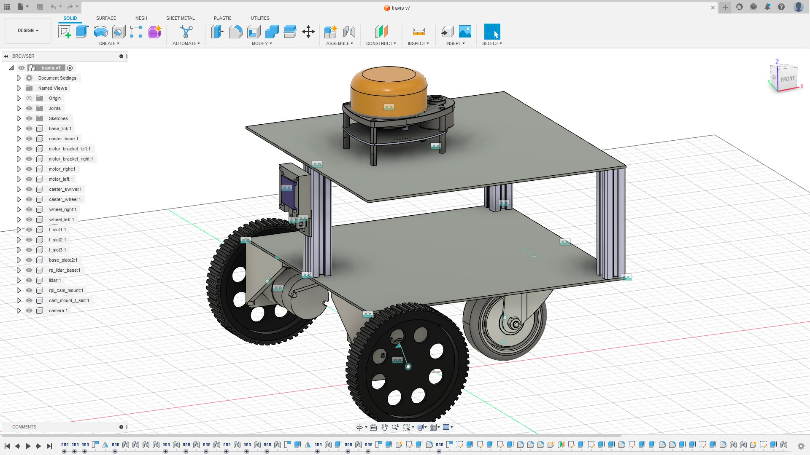
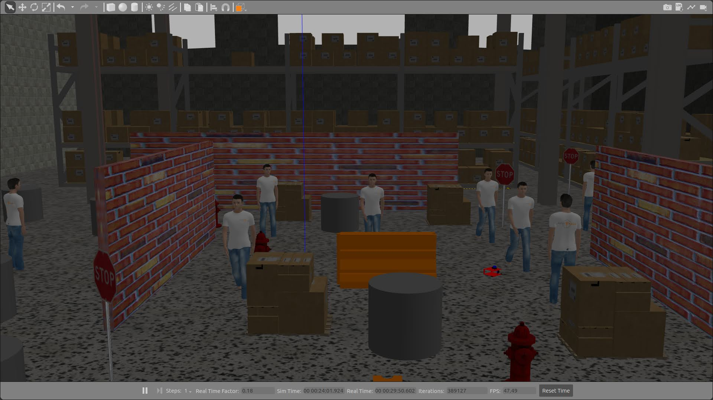
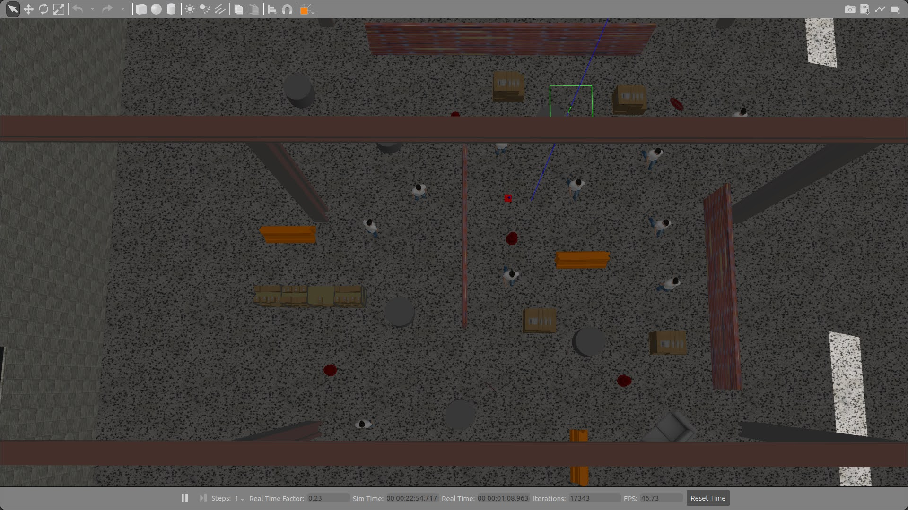
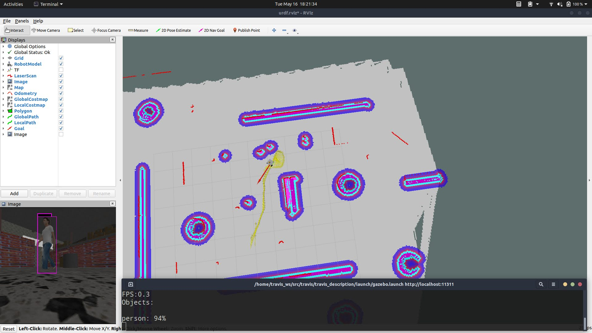

# _travis_

That was the name of my cat.

This repository contains various ROS Noetic packages for an Indoor autonomous differential drive rover with ODCL.
I built this to keep me occupied in my free time after working a job and on a startup during the day.

## Setup instructions:
I will have to retrieve commands and setup scripts from the robot hardware. Please ping me if you need it or I will update the README at a later date.

## Software:
* Built on ROS Noetic
* Darknet-ros package using yolo v3 for object detection (I wasn't into ML/CV back then and hence)
* NavStack for SLAM using AMCL and path planning using GlobalPlanner and eband local planner
* Robot bringup script on power as systemd service
* I get an email with its current IP and URL for proxy via ngrok for remote access

## Hardware:
* Simple custom hardware and CAD/URDF model designed in Fusion 360
* Jetson Nano for main compute
* ESP-32 S3 running ROS-Serial for low-level control and diff-drive controller
* RP LiDAR A1 2D lidar for mapping
* MD10C motor drivers(I just had them on hand)
* 12V Brushed DC geared motors with quadrature encoders
* USB webcam for ODCL
* 12V Li-ion battery
* Mobile power bank to power LiDAR
* 12V-5V 3A buck converter for Jetson Nano
* A random caster wheel I found in my stash

## CAD model:

## Final Simulation environment:
 

## Navigation test:

## Final Simulation demo:

## Partially assembled hardware (I don't seem to have the finished hardware photos):

## Hardware testing(untuned. I dismantled the hardware without more photos or videos):

